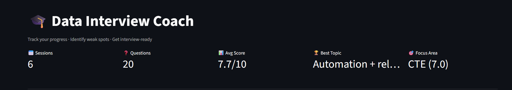
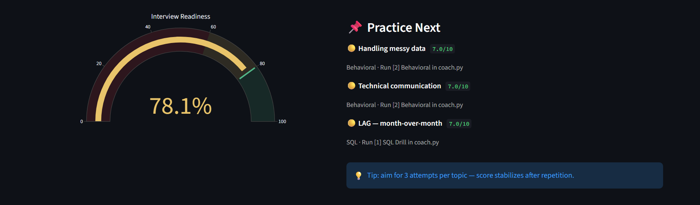
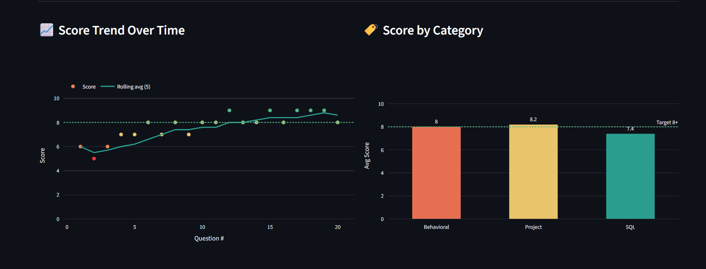
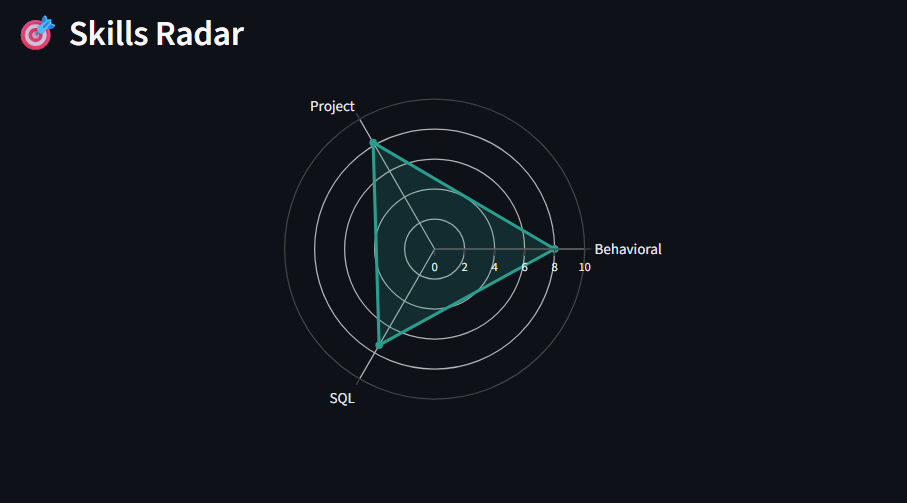
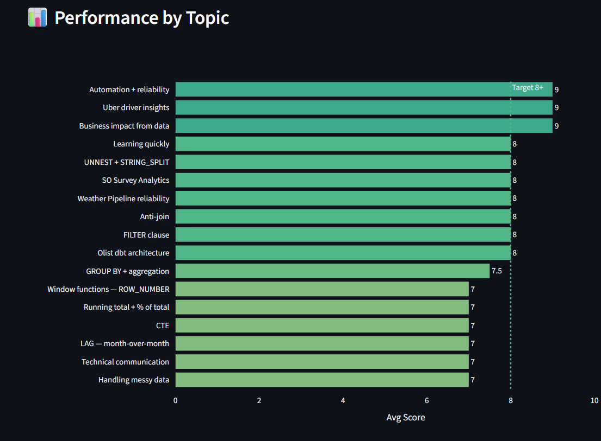
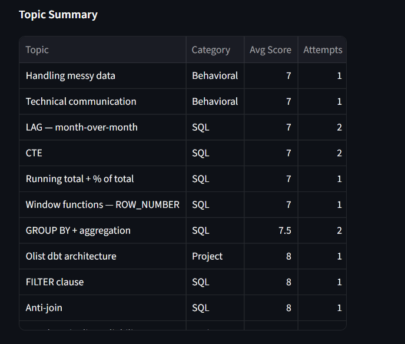
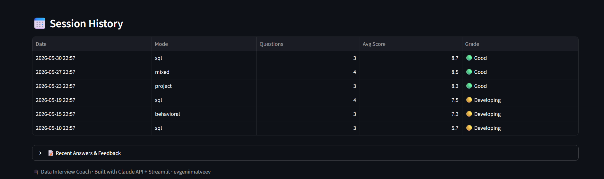
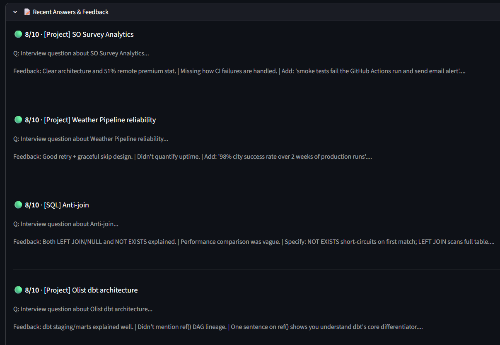
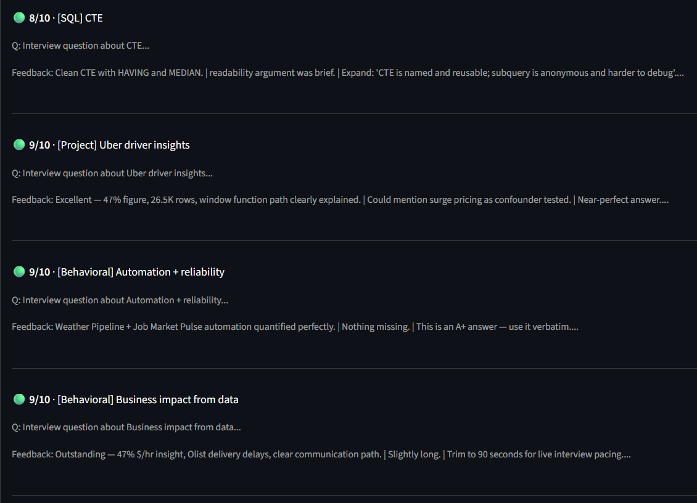
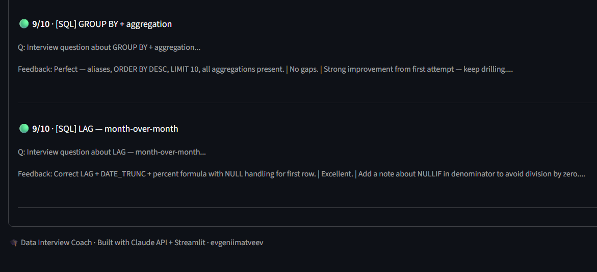

# 🎓 Data Interview Coach


AI-powered interview practice tool for Data Analyst / Analytics Engineer roles.  
Practice SQL, behavioral, and project-deep questions — Claude evaluates each answer live with streaming feedback.

**[🤗 Live Demo on HuggingFace Spaces →](https://huggingface.co/spaces/evgeniimatveevusa/interview-coach)**  
*Seeded with 6 demo sessions showing a realistic 3-week improvement arc. CLI requires local setup with your own Anthropic API key.*

---

## Architecture

```
┌──────────────┐   answer    ┌─────────────────────┐   streaming   ┌───────────────────┐
│   👤 User    │──────────→  │   🖥️  coach.py       │─────────────→ │  🤖 Claude Sonnet  │
│              │ ←────────── │   Rich CLI           │ ←──────────── │  API + caching    │
└──────────────┘  feedback   └──────────┬──────────┘   scored eval  └───────────────────┘
                                        │ save session
                              ┌─────────▼─────────┐
                              │  💾 SQLite DB      │
                              │  interview.db      │
                              └─────────┬─────────┘
                                        │ read history
                              ┌─────────▼─────────┐      deploy     ┌────────────────┐
                              │  📊 dashboard.py   │───────────────→ │  🤗 HF Spaces  │
                              │  Streamlit         │                 │  Docker        │
                              └───────────────────┘                 └────────────────┘
```

---

## Practice modes

| Mode | Questions | Focus |
|------|-----------|-------|
| SQL Drill | 12 | Window functions · CTEs · UNNEST · LAG · Cohort · Dedup · WHERE vs HAVING |
| Behavioral | 9 | STAR stories · Tell me about yourself · Weakness · 5-year goal |
| Project Deep | 8 | Olist · Uber · Weather Pipeline · MCP Agent · SO Survey · HR BI · Interview Coach |
| Stats & A/B Testing | 6 | Mean vs Median · p-value · Type I/II errors · A/B test design · Pitfalls |
| Mixed | 12 | All categories — real interview simulation |

---

## Dashboard

<details>
<summary>📊 KPI Overview</summary>





</details>

<details>
<summary>📈 Score Analytics</summary>



</details>

<details>
<summary>🎯 Skills Radar</summary>



</details>

<details>
<summary>📋 Performance by Topic</summary>





</details>

<details>
<summary>📅 Session History</summary>



</details>

<details>
<summary>📝 Recent Answers & Claude Feedback</summary>

*Each answer is scored 1–10 with specific, actionable feedback from Claude Sonnet.*







</details>

---

## Features

- **Streaming feedback** — Claude's evaluation appears word-by-word in the terminal
- **Prompt caching** — system prompt cached across questions (~70% cost reduction)
- **Progress tracking** — SQLite stores every answer; dashboard shows trend, radar, weak spots
- **Interview Readiness gauge** — weighted score (SQL 40% · Behavioral 35% · Project 25%)
- **Practice Next panel** — auto-recommends the 3 weakest topics each session

---

## Stack

`Python 3.11` · `Anthropic Claude API` (streaming + prompt caching) · `Rich` · `Streamlit` · `Plotly` · `SQLite` · `Docker`

---

## Local setup

```bash
git clone https://github.com/evgeniimatveev/interview-coach
cd interview-coach
python -m venv .venv && .venv\Scripts\activate   # Windows
pip install -r requirements.txt
cp .env.example .env                              # add ANTHROPIC_API_KEY
python coach.py
```

```bash
streamlit run dashboard.py   # dashboard only (no API key needed)
```

---

Built by [Evgenii Matveev](https://datascienceportfol.io/evgeniimatveevusa) · May 2026
