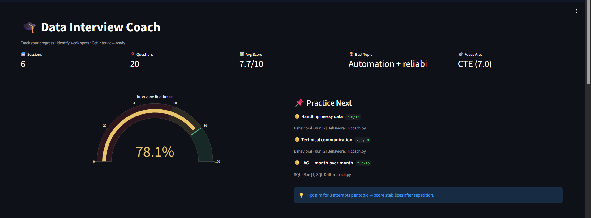
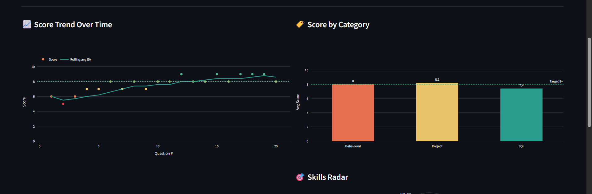
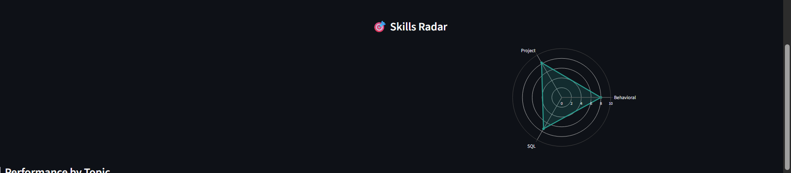
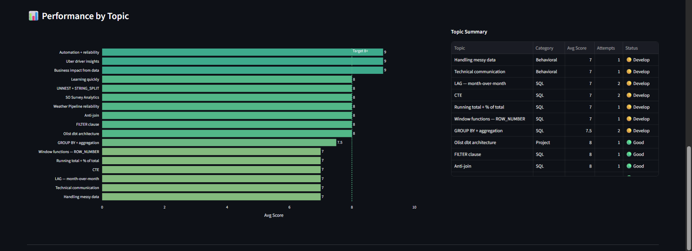
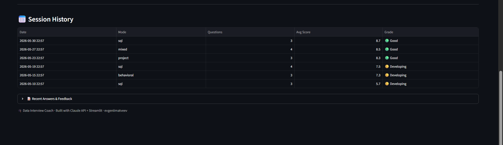
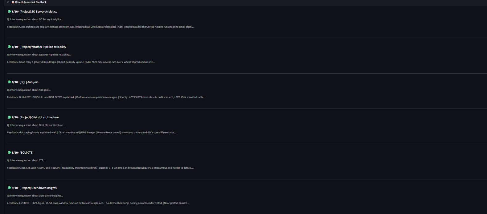
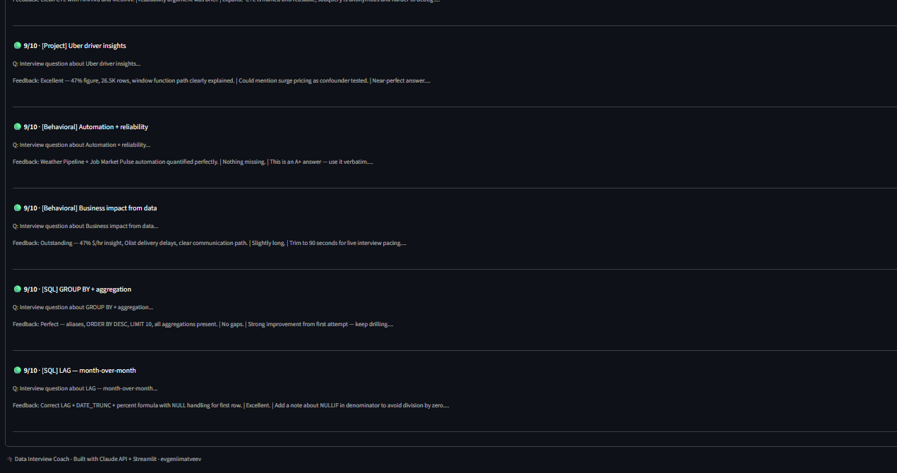

# 🎓 Data Interview Coach

AI-powered interview practice tool for Data Analyst / Analytics Engineer roles.  
Practice SQL, behavioral, and project-deep questions — Claude evaluates each answer live with streaming feedback.

**[Live Demo →](https://huggingface.co/spaces/evgeniimatveevusa/interview-coach)** — seeded with 6 demo sessions showing a realistic 3-week improvement arc.  
*CLI requires local setup with your own Anthropic API key.*

---

## Dashboard















---

## How it works

```
coach.py (Rich CLI)  →  SQLite  →  dashboard.py (Streamlit)
        ↕
  Claude API
  streaming + prompt caching
```

**CLI** (`coach.py`): Rich terminal interface — pick a mode, answer questions, get real-time scored feedback streamed by Claude Sonnet.  
**Dashboard** (`dashboard.py` / HF Spaces): Streamlit app tracking score trends, skill radar, weak spots, and "practice next" recommendations.

---

## Practice modes

| Mode | Questions | Focus |
|------|-----------|-------|
| SQL Drill | 8 | Window functions · CTEs · UNNEST · LAG · Anti-join |
| Behavioral | 6 | STAR stories from real portfolio projects |
| Project Deep | 6 | Olist · Uber · Weather Pipeline · MCP Agent · SO Survey |
| Mixed | 10 | Full interview simulation |

---

## Stack

`Python 3.11` · `Anthropic Claude API` (streaming + prompt caching) · `Rich` · `Streamlit` · `Plotly` · `SQLite` · `Docker`

---

## Features

- **Streaming feedback** — Claude's evaluation appears word-by-word in the terminal
- **Prompt caching** — system prompt cached across questions (~70% cost reduction)
- **Progress tracking** — SQLite stores every answer; dashboard shows trend, radar chart, weak spots
- **Interview Readiness gauge** — weighted score (SQL 40% · Behavioral 35% · Project 25%)
- **Practice Next panel** — auto-recommends the 3 weakest topics each session

---

## Local setup

```bash
git clone https://github.com/evgeniimatveev/interview-coach
cd interview-coach
python -m venv .venv && .venv\Scripts\activate   # Windows
pip install -r requirements.txt
cp .env.example .env                              # add ANTHROPIC_API_KEY
python coach.py
```

## Dashboard (local)

```bash
streamlit run dashboard.py
```

---

Built by [Evgenii Matveev](https://datascienceportfol.io/evgeniimatveevusa) · May 2026
